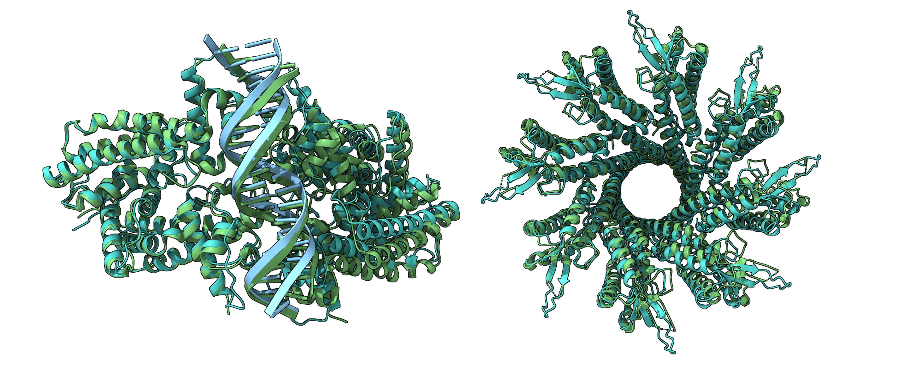
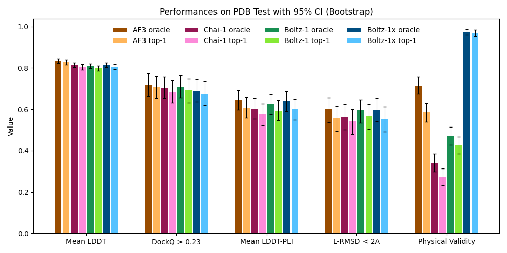
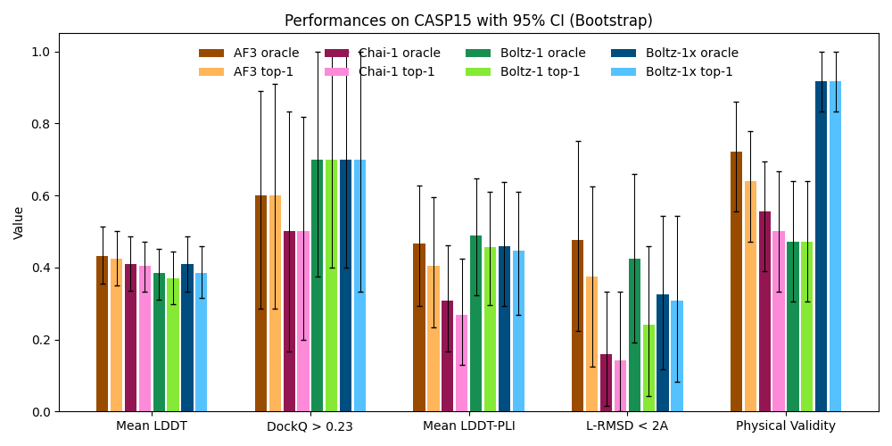

<div align="center">
  <div>&nbsp;</div>
  

[Paper](https://doi.org/10.1101/2024.11.19.624167) |
[Slack](https://join.slack.com/t/boltz-community/shared_invite/zt-2zj7e077b-D1R9S3JVOolhv_NaMELgjQ) <br> <br>
</div>





## Introduction

Boltz-1 is the state-of-the-art open-source model to predict biomolecular structures containing combinations of proteins, RNA, DNA, and other molecules. It also supports modified residues, covalent ligands and glycans, as well as conditioning the prediction on specified interaction pockets or contacts. 

All the code and weights are provided under MIT license, making them freely available for both academic and commercial uses. For more information about the model, see our [technical report](https://doi.org/10.1101/2024.11.19.624167). To discuss updates, tools and applications join our [Slack channel](https://join.slack.com/t/boltz-community/shared_invite/zt-2zj7e077b-D1R9S3JVOolhv_NaMELgjQ).

### Extended Capabilities

#### RNA-Specialized Boltz
We've enhanced Boltz with dedicated RNA structure prediction capabilities through a specialized RNA MSA Module. This extension offers:
- Improved RNA structure prediction through optimized RNA-specific MSA generation
- Enhanced handling of RNA-specific structural features and tertiary interactions
- Superior performance on RNA-protein and RNA-ligand complex predictions
- Specialized processing pipeline for RNA structures in various formats

#### End-to-End Fine-tuning Pipeline for Protein-Ligand Complexes
Our fine-tuning pipeline for protein-ligand complex prediction provides:
- State-of-the-art performance (5th place in anti-viral ligand pose prediction challenge)
- Robust molecule processing with automatic fixing of problematic ligand structures
- Integration with advanced docking tools for enhanced binding site prediction
- Optimized modeling of protein-ligand interactions with improved accuracy

## Installation
Install boltz with PyPI (recommended):

```
pip install boltz -U
```

or directly from GitHub for daily updates:

```
git clone https://github.com/jwohlwend/boltz.git
cd boltz; pip install -e .
```
> Note: we recommend installing boltz in a fresh python environment

## Inference

You can run inference using Boltz-1 with:

```
boltz predict input_path --use_msa_server
```

For RNA-specialized prediction, use:

```
boltz predict input_path --use_msa_server --rna_mode
```

For optimized protein-ligand complex prediction with the fine-tuned model:

```
boltz predict input_path --use_msa_server --ligand_mode
```

Boltz currently accepts three input formats:

1. Fasta file, for most use cases

2. A comprehensive YAML schema, for more complex use cases

3. A directory containing files of the above formats, for batched processing

To see all available options: `boltz predict --help` and for more information on these input formats, see our [prediction instructions](docs/prediction.md).

## Evaluation

To encourage reproducibility and facilitate comparison with other models, we provide the evaluation scripts and predictions for Boltz-1, Chai-1 and AlphaFold3 on our test benchmark dataset as well as CASP15. These datasets are created to contain biomolecules different from the training data and to benchmark the performance of these models we run them with the same input MSAs and same number  of recycling and diffusion steps. More details on these evaluations can be found in our [evaluation instructions](docs/evaluation.md).





## Training

If you're interested in retraining the model, see our [training instructions](docs/training.md).

### Specialized Training Pipelines

We also provide dedicated training pipelines for specialized tasks:

1. **RNA Structure Prediction**
   - Utilizes our RNA MSA Module for optimized RNA feature extraction
   - Specialized data processing for RNA structures using `rna_process.py`
   - Custom training configurations optimized for RNA folding

2. **Protein-Ligand Complex Fine-tuning**
   - End-to-end fine-tuning framework for protein-ligand interaction prediction
   - Robust pre-processing with automatic molecule error fixing
   - Integration with state-of-the-art docking tools
   - Solution ranked 5th in anti-viral ligand pose prediction challenge

For more details, see the specialized READMEs in the `boltz/stanford-rna` and `boltz_diffdock_pipeline` directories.

## Contributing

We welcome external contributions and are eager to engage with the community. Connect with us on our [Slack channel](https://join.slack.com/t/boltz-community/shared_invite/zt-2zj7e077b-D1R9S3JVOolhv_NaMELgjQ) to discuss advancements, share insights, and foster collaboration around Boltz-1.

## License

Our model and code are released under MIT License, and can be freely used for both academic and commercial purposes.


## Cite

If you use this code or the models in your research, please cite the following paper:

```bibtex
@article{wohlwend2024boltz1,
  author = {Wohlwend, Jeremy and Corso, Gabriele and Passaro, Saro and Reveiz, Mateo and Leidal, Ken and Swiderski, Wojtek and Portnoi, Tally and Chinn, Itamar and Silterra, Jacob and Jaakkola, Tommi and Barzilay, Regina},
  title = {Boltz-1: Democratizing Biomolecular Interaction Modeling},
  year = {2024},
  doi = {10.1101/2024.11.19.624167},
  journal = {bioRxiv}
}
```

If you use our RNA-specialized features or protein-ligand fine-tuning pipeline, please also cite:

```bibtex
@article{boltz_extensions,
  title={Extended Boltz: RNA-Specialized Structure Prediction and Ligand Pose Optimization},
  author={[Your Name]},
  journal={[Journal/Preprint]},
  year={2024}
}
```

In addition if you use the automatic MSA generation, please cite:

```bibtex
@article{mirdita2022colabfold,
  title={ColabFold: making protein folding accessible to all},
  author={Mirdita, Milot and Sch{\"u}tze, Konstantin and Moriwaki, Yoshitaka and Heo, Lim and Ovchinnikov, Sergey and Steinegger, Martin},
  journal={Nature methods},
  year={2022},
}
```
