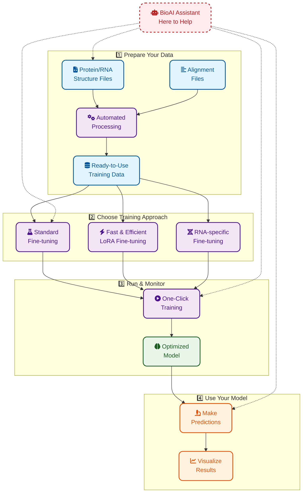

# Boltz Fine-tuning

This repository focuses on extending the capabilities of Boltz-1, the state-of-the-art open-source model for biomolecular structure prediction. For the original Boltz-1 model and its capabilities, please refer to the [original repository](https://github.com/jwohlwend/boltz).

## Installation

To install the extended capabilities, run:

```bash
git clone https://github.com/wiwnopgm/boltz-finetune.git
cd boltz-finetune
pip install -e .
```
> Note: We strongly recommend installing in a fresh Python environment to avoid dependency conflicts.

## BioAI Agent on Model Context Protocol (MCP Server)



This repository features a specialized BioAI agent built on the Model Context Protocol (MCP) server for streamlining protein structure prediction workflows with Boltz-1. The MCP server provides a comprehensive infrastructure for both training and inference, enabling researchers to effectively leverage Boltz-1's capabilities without managing complex computational details. See the detailed documentation in [docs/bioai_agent.md](docs/bioai_agent.md) for more information.

## Extended Capabilities

This extension to Boltz-1 include enhanced training architectures and specialized modules for RNA structure prediction. The following sections detail the key features and usage instructions.

### Fine-tuning Pipeline

Working with 3D molecular structures is challenging, as training data preparation for PDB structures and their Multiple Sequence Alignments (MSA) consists of multiple stages. To streamline this pre-processing step, we have created a unified pipeline that simplifies the process to just specifying paths to your PDB and MSA raw data.

#### Dataset Preparation

1. Download and start the Chemical Component Dictionary (CCD) database:
```bash
wget https://boltz1.s3.us-east-2.amazonaws.com/ccd.rdb
redis-server --dbfilename ccd.rdb --port 7777
```

2. Download and start the Taxonomy database:
```bash
wget https://boltz1.s3.us-east-2.amazonaws.com/taxonomy.rdb
redis-server --dbfilename taxonomy.rdb --port 7778
```

3. Prepare your input files:
   - PDB or mmCIF/CIF files containing 3D complex structures
   - MSA files: pre-computed alignments can be generated using `run_mmseqs2`

#### Data Processing

Use our unified processing script by specifying the paths to all necessary inputs:

```bash
python scripts/process/run_pipeline.py \
  --data_dir /path/to/pdb_or_mmcif_files \
  --msa_dir  /path/to/a3m_files \
  --output_dir /path/to/output
```

### RNA-Specific Capabilities

We have enhanced the model with specialized RNA processing capabilities:

- Custom MSA module with RNA-specific feature extraction
- Advanced processing of RNA structural features and tertiary interactions

### Fine-tuning Instructions

This pipeline supports several fine-tuning approaches, primarily configured through the `finetune_config` section in `scripts/train/configs/full_finetune.yaml`. Here's a detailed explanation of the configuration options:

```yaml
# Finetune configuration
finetune_config:
  # Whether to freeze all parameters by default
  freeze_all: true
  
  # Module-specific freeze controls (override freeze_all)
  freeze_msa_module: true    # Keep MSA module frozen
  freeze_confidence: false   # Allow confidence module to be fine-tuned
  freeze_structure: true     # Keep structure module frozen
  
  # LoRA configuration
  use_lora: true # set to false when fine-tuning with full model or specific modules
  lora_r: 8      # Rank of LoRA adaptation matrices
  lora_alpha: 16 # Scaling factor for LoRA
  lora_dropout: 0.1
  
  # Which modules to apply LoRA to
  lora_modules:
    confidence: true  # Apply LoRA to confidence module
    structure: false  # Don't apply LoRA to structure module
  
  # Which layer types to apply LoRA to
  lora_layer_types:
    linear: true      # Apply to linear layers
    embedding: true   # Apply to embedding layers
    attention: true   # Apply to attention mechanisms
```

#### Fine-tuning Approaches Explained

1. **Parameter Efficient LoRA Fine-tuning** - Parameter-efficient fine-tuning that adds small trainable rank decomposition matrices to existing weights without modifying the original parameters:
   - Set `use_lora: true`
   - Specify modules to apply LoRA to under `lora_modules`. Current options include Linear, Embedding, or AttentionPairBias.
   - Advantages: Requires less memory, faster training, prevents catastrophic forgetting

2. **Full Model Fine-tuning** - Traditional fine-tuning that updates all model weights:
   - Set `use_lora: false` and `freeze_all: false`
   - Advantages: Potentially higher adaptation capability for significantly different tasks
   - Disadvantages: Requires more GPU memory, risk of overfitting

3. **Selective Module Fine-tuning** - Fine-tune specific components:
   - Set `use_lora: false`
   - Set `freeze_all: true`
   - Set specific module freeze parameters to `false` (e.g., `freeze_confidence: false`)

#### Running Fine-tuning

To start fine-tuning with your configured settings:

```bash
python scripts/train/train.py scripts/train/configs/full_finetune.yaml
```

#### Key Parameters

- **Learning Rate**: `model.training_args.max_lr=0.0018`
- **Batch Size**: `data.batch_size=1`
- **Gradient Accumulation**: `trainer.accumulate_grad_batches=128`
- **Training Epochs**: `trainer.max_epochs=10` (use `-1` for unlimited)
- **Output Directory**: `output=/path/to/output`

#### For Distributed Training

For hyperparameter sweeps or distributed training on SLURM clusters, use our template script:

```bash
# Set parameters to sweep
export PARAM1_VALUES="0.3 0.5 0.7"  # Example: pocket conditioning proportion
export PARAM2_VALUES="1 2 4"        # Example: batch size
export PARAM3_VALUES="0.001 0.0018" # Example: learning rate

# Set parameter paths
export PARAM1_PATH="data.train_binder_pocket_conditioned_prop" 
export PARAM2_PATH="data.batch_size"
export PARAM3_PATH="model.training_args.max_lr"

# Set job configuration
export JOB_NAME="boltz_finetune"
export OUTPUT_BASE_DIR="./output/parameter_sweep"
export CONFIG_FILE="scripts/train/configs/full_finetune.yaml"

# Launch jobs
sbatch scripts/train/slurm_scripts/parallel_run_finetune_template.sbatch
```

Each job in the array will use a different combination of parameters, with results organized in separate output directories for easy comparison.

### Performance Optimizations

The pipeline includes several optimizations for enhanced training performance:
- Parameter Efficient LoRA-finetuning
- RNA-specific MSA module
- (WIP) Memory bottleneck optimization: Kernel Optimization for MSA module

### Analysis Tools

*Coming soon: Comprehensive documentation for prediction analysis tools and visualization scripts*

## Real-World Applications

This fine-tuning pipeline has demonstrated its effectiveness in real-world applications:
- Achieved 5th place out of 80+ submissions in the [anti-viral ligand pose challenge](https://polarishub.io/competitions/asap-discovery/antiviral-drug-discovery-2025#competiton-results)

## Citations

If you use this work, please cite both the original Boltz-1 paper and our fine-tuning extensions:

```bibtex
@article{wohlwend2024boltz1,
  author = {Wohlwend, Jeremy and Corso, Gabriele and Passaro, Saro and Reveiz, Mateo and Leidal, Ken and Swiderski, Wojtek and Portnoi, Tally and Chinn, Itamar and Silterra, Jacob and Jaakkola, Tommi and Barzilay, Regina},
  title = {Boltz-1: Democratizing Biomolecular Interaction Modeling},
  year = {2024},
  doi = {10.1101/2024.11.19.624167},
  journal = {bioRxiv}
}

@article{mirdita2022colabfold,
  title={ColabFold: making protein folding accessible to all},
  author={Mirdita, Milot and Sch{\"u}tze, Konstantin and Moriwaki, Yoshitaka and Heo, Lim and Ovchinnikov, Sergey and Steinegger, Martin},
  journal={Nature methods},
  year={2022},
}

@article{boltz_finetuning,
  title={Extended Boltz: RNA-Specialized Structure Prediction and Ligand Pose Optimization},
  author={[Your Name]},
  journal={[Journal/Preprint]},
  year={2024}
}
```